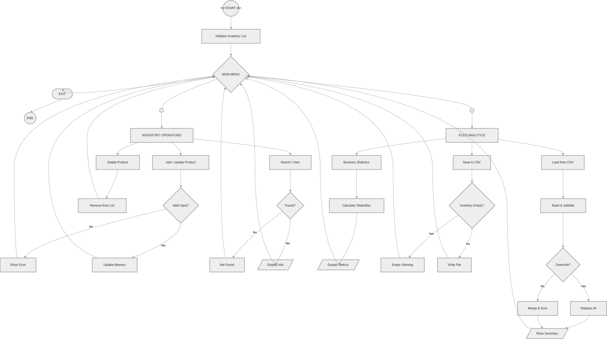

# Inventory Management System 🗂️

A console-based inventory management system built in Python. Supports full CRUD operations, statistics, and CSV file persistence.

---

## 📁 Project Structure

```
inventory-basics/
├── app.py          # Main entry point — runs the menu
├── servicios.py    # CRUD operations and statistics
└── archivos.py     # CSV save and load logic
```

---

## ▶️ How to Run

1. Place all three files in the same folder.
2. Open `app.py` in your Python environment (terminal, VS Code, Pydroid, etc.).
3. Run it:

```bash
python app.py
```


## 🔀 Flowchart

---

## 🛠️ Requirements

- Python 3.6 or higher
- No external libraries needed — only the built-in `csv` module

---

## 👤 Author

**Breyner** — RIWI Software Development Student
